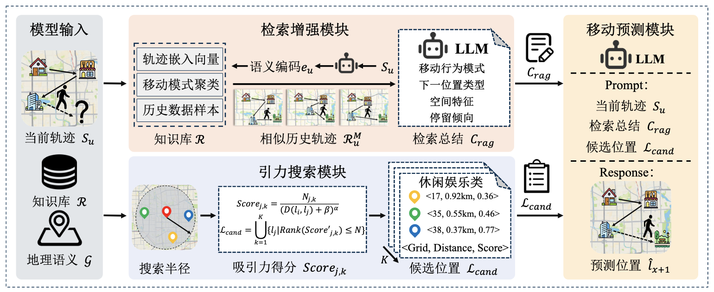

# 基于检索增强生成与引力模型的用户移动行为预测 (RAG^2-MP)

## 摘要 (Abstract)
移动行为预测对城市交通调度、位置推荐服务与应急管理具有重要意义。现有基于大语言模型（LLMs）的移动行为预测方法虽然在语义推理上表现出色，但其受限于仅依赖内部静态参数记忆，难以显式地捕捉历史数据中的统计特征与移动模式，同时缺乏空间感知能力，无法有效量化物理空间的距离约束与区域吸引力，导致预测结果在地理层面往往缺乏合理性。针对上述局限，本文提出一种融合检索增强生成（RAG）与改进引力模型的移动行为预测框架。具体而言，该框架设计了检索增强模块，通过构建历史轨迹知识库并实时检索相似的群体行为模式，将隐式的移动规律转化为显式的结构化知识，使模型能够摆脱静态参数限制，动态利用实证数据进行推理；同时引入改进的引力搜索模块，显式建模POI分布与地理距离的非线性衰减关系，为预测提供可解释的物理约束与候选先验；最后利用大语言模型作为决策中枢整合多源信息进行语义预测。本文在三个大规模真实世界数据集上进行了广泛实验。结果表明，所提方法在 Acc@1、Acc@5 和 MRR@5 指标上相比现有的最先进基线模型平均提升了 10.02%、11.32% 和 8.91%，验证了该方法的有效性与鲁棒性。进一步分析表明，该框架具备强大的跨城市泛化能力，且通过扩展知识库规模能显著增强模型性能。

## 方法简介 (Methodology)
本文提出了一种融合检索增强生成（RAG）与改进引力模型的移动行为预测框架。其整体模型架构包括：
- **移动预测模块**：利用大语言模型作为决策中枢整合多源信息，在接收候选先验输入后，进行语义推理以获得最终预测。
- **检索增强模块**：通过构建历史轨迹知识库并实时检索相似的群体行为模式，将隐式的移动规律转化为显式的结构化知识，使模型能够摆脱静态参数限制，动态利用实证数据进行推理。
- **引力搜索模块**：显式建模POI分布与地理距离的非线性衰减关系，为预测提供可解释的物理约束与候选先验。

模型工作原理和流程可参考下图：



## 数据集介绍 (Datasets)
本项目使用的大规模移动轨迹数据集覆盖了三个主要城市，并已进行了脱敏处理与标准化网格 (Grid) 划分。不同城市对应的原始数据来源如下：

1. **北京数据集 (Beijing)**：
   - **名称**：CoPB (City of PEK Behavior)
   - **规模**：涵盖了北京百万级以上的匿名用户手机信令信令或相关出行轨迹。
   - **来源**：[https://github.com/tsinghua-fib-lab/CoPB](https://github.com/tsinghua-fib-lab/CoPB)

2. **深圳数据集 (Shenzhen)**：
   - **名称**：深圳私家车轨迹数据集
   - **规模**：包含大量深圳市私家车 GPS 轨迹与出行活动网络数据。
   - **来源**：[https://github.com/HunanUniversityZhuXiao/PrivateCarTrajectoryData](https://github.com/HunanUniversityZhuXiao/PrivateCarTrajectoryData)

3. **上海数据集 (Shanghai)**：
   - **名称**：电信 App 长期使用/移动数据集
   - **规模**：包含长期的大规模 App 分发及基站级的匿名移动数据。
   - **来源**：[https://fi.ee.tsinghua.edu.cn/appusage/](https://fi.ee.tsinghua.edu.cn/appusage/)
   
> **Note**: 数据集预处理代码可以在 `raw_data/` 及 `dataset/dataset.py` 中找到，并存放在 `util/rag_database/` 文件夹中。

## 如何运行代码 (How to Run)

### 1. 环境准备 (Environment Setup)
你可以使用 `conda` 创建并激活推荐的依赖环境：
```bash
conda env create -f environment.yml
conda activate rag2-mp
```

### 2. 准备数据和 RAG 数据库
相关的检索数据库存在 `util/rag_database/` 下面（以 Gemma、Llama、Qwen 进行了构建）。
你也可以利用重力拟合脚本来自定义各城市的区域连接权重：
```bash
python util/fit_gravity_weight.py
python util/build_rag_database.py
```

### 3. 开始训练与测试 (Training & Testing)
使用以下命令启动模型的训练或测试管线。模型配置如学习率、网络结构、RAG 参数、数据集指定等均在 `config/config.yaml` 中设置。

```bash
python trainer/trainer.py --config config/config.yaml
```

当你需要打印更详尽的推断日志以调试和分析时，也可以执行:
```bash
python trainer/detailed_trainer.py --config config/config.yaml
```

所有的微调 Checkpoint、训练日志以及指标 (Metrics) 都会按超参数保存在 `output/` 文件夹下游中。
