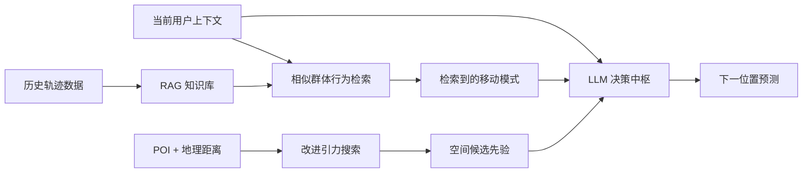

<div align="center">

# RAG²-MP
### 基于检索增强生成与引力模型的用户移动行为预测

**中文 | [English](README_EN.md)**

[](https://cjc.ict.ac.cn/)
[](https://cjc.ict.ac.cn/)

**Bo Liu · Tong Li · Zhu Xiao · Zhuo Tang · Kenli Li**

*《计算机学报》, 2026 — 已录用*

</div>

---

## 项目简介

**RAG²-MP** 面向用户移动行为预测，将 **Retrieval-Augmented Generation (RAG)** 与改进的 **Gravity Model** 结合，并利用大语言模型统一整合历史群体移动模式、空间吸引力、地理距离和当前上下文信息。相比仅依赖 LLM 参数记忆的预测方式，本方法为 LLM 提供了可检索的经验知识与显式的空间先验，使预测同时具备语义推理能力和物理空间合理性。

<p align="center">
  
</p>

<p align="center"><em>RAG²-MP 整体框架：历史行为检索、引力先验与 LLM 决策协同完成下一位置预测。</em></p>

## 摘要

移动行为预测对城市交通调度、位置推荐服务与应急管理具有重要意义。现有基于大语言模型（LLMs）的移动行为预测方法虽然在语义推理上表现出色，但其受限于仅依赖内部静态参数记忆，难以显式地捕捉历史数据中的统计特征与移动模式，同时缺乏空间感知能力，无法有效量化物理空间的距离约束与区域吸引力，导致预测结果在地理层面往往缺乏合理性。针对上述局限，本文提出一种融合检索增强生成（RAG）与改进引力模型的移动行为预测框架。具体而言，该框架设计了检索增强模块，通过构建历史轨迹知识库并实时检索相似的群体行为模式，将隐式的移动规律转化为显式的结构化知识，使模型能够摆脱静态参数限制，动态利用实证数据进行推理；同时引入改进的引力搜索模块，显式建模 POI 分布与地理距离的非线性衰减关系，为预测提供可解释的物理约束与候选先验；最后利用大语言模型作为决策中枢整合多源信息进行语义预测。本文在三个大规模真实世界数据集上进行了广泛实验。结果表明，所提方法在 Acc@1、Acc@5 和 MRR@5 指标上相比现有先进基线模型平均提升了 **10.02%、11.32% 和 8.91%**。进一步分析表明，该框架具备较强的跨城市泛化能力，并且通过扩展知识库规模能够进一步提升预测表现。

## 核心思路

RAG²-MP 主要解决两个问题：

1. **LLM 缺少显式历史行为知识。** 参数记忆很难针对某个城市、某类用户动态调用真实历史移动模式，因此通过 RAG 构建历史轨迹知识库并在推理时检索相似样本。
2. **LLM 缺少物理空间约束。** 仅靠文本语义可能产生距离不合理的候选位置，因此通过引力模型显式建模区域吸引力和距离衰减。



## 方法模块

### 1. Retrieval-Augmented Mobility Knowledge

`model/RAG.py` 负责检索增强模块。该模块将历史移动规律组织为可查询知识，并在预测阶段根据当前用户行为检索最相似的群体移动模式。这样，LLM 不必完全依赖参数内部的静态知识，而可以直接使用来自真实历史数据的证据。

### 2. Improved Gravity Search

`model/Gravity.py` 实现空间引力模块。通过结合 POI 分布、区域吸引力和地理距离，该模块为候选位置提供具有物理解释性的空间先验，并降低明显不合理的远距离候选被选中的概率。

### 3. LLM-Based Semantic Decision

`model/LLM.py` 和 `model/Predictor.py` 将检索知识、引力候选和当前上下文输入到统一的语义决策过程，最终输出下一位置预测结果。

## 代码与论文模块对应

| 论文模块 | 代码位置 | 作用 |
| --- | --- | --- |
| RAG 历史行为检索 | `model/RAG.py` | 构建 / 查询历史移动知识 |
| 改进引力模型 | `model/Gravity.py` | 空间吸引力与距离先验 |
| LLM 推理 | `model/LLM.py` | 多源上下文语义推理 |
| 预测器 | `model/Predictor.py` | 协调各模块并输出结果 |
| 数据读取 | `dataset/dataset.py` | 构建训练 / 测试样本 |
| 原始数据处理 | `raw_data/mobility_process.py` | 轨迹预处理 |
| 实验配置 | `config/config.yaml` | 数据、模型、RAG、训练参数 |
| 标准训练 / 测试 | `trainer/trainer.py` | 主实验流程 |
| 详细推理日志 | `trainer/detailed_trainer.py` | Case study 与过程分析 |

## 数据集

实验涉及北京、深圳、上海等真实世界移动行为数据。数据集本身需按照原始数据提供方要求获取和使用。

| 城市 / 数据 | 数据类型 | 来源 |
| --- | --- | --- |
| Beijing / CoPB | 城市移动轨迹 | https://github.com/tsinghua-fib-lab/CoPB |
| Shenzhen | 私家车 GPS 轨迹 | https://github.com/HunanUniversityZhuXiao/PrivateCarTrajectoryData |
| Shanghai | App / 移动数据 | https://fi.ee.tsinghua.edu.cn/appusage/ |

## 评价指标

论文主要使用：

- **Acc@1**：Top-1 预测是否命中真实位置。
- **Acc@5**：真实位置是否出现在前 5 个候选中。
- **MRR@5**：综合考虑真实位置在 Top-5 中的排序位置。

论文报告 RAG²-MP 相比强基线平均提升 **10.02% / 11.32% / 8.91%**。

## 环境配置

```bash
conda env create -f environment.yml
conda activate rag2-mp
```

## 运行流程

### Step 1：准备数据

原始轨迹预处理逻辑位于：

```text
raw_data/mobility_process.py
```

### Step 2：构建 RAG 数据库与引力先验

```bash
python util/fit_gravity_weight.py
python util/build_rag_database.py
```

### Step 3：训练 / 测试

```bash
python trainer/trainer.py --config config/config.yaml
```

如需查看更详细的检索、候选和推理过程：

```bash
python trainer/detailed_trainer.py --config config/config.yaml
```

## 仓库结构

```text
RAG2-MP/
├── config/
│   └── config.yaml                # 实验配置
├── dataset/
│   └── dataset.py                 # 数据集读取
├── model/
│   ├── Gravity.py                 # 改进引力搜索
│   ├── LLM.py                     # LLM 推理
│   ├── Predictor.py               # 总体预测器
│   └── RAG.py                     # 检索增强模块
├── raw_data/                      # 原始轨迹处理
├── trainer/
│   ├── trainer.py                 # 主训练 / 评测
│   └── detailed_trainer.py        # 详细日志与 case study
├── util/                          # RAG 数据库 / 引力权重工具
├── sources/
│   └── framework.png              # 论文框架图
├── environment.yml
├── README.md                      # 中文
└── README_EN.md                   # English
```

## 论文信息

论文 **“A Mobility Prediction Method Based on Retrieval-Augmented Generation and Gravity Model”** 已被 **《计算机学报》**录用。

- **期刊：**《计算机学报》 / Chinese Journal of Computers
- **状态：** Accepted
- **期刊主页：** https://cjc.ict.ac.cn/

> 正式卷期、页码、DOI 和全文下载链接将在期刊正式出版后更新。

## Citation

```bibtex
@article{liu2026rag2mp,
  title   = {A Mobility Prediction Method Based on Retrieval-Augmented Generation and Gravity Model},
  author  = {Liu, Bo and Li, Tong and Xiao, Zhu and Tang, Zhuo and Li, Kenli},
  journal = {Chinese Journal of Computers},
  year    = {2026},
  note    = {Accepted}
}
```

## 作者与联系

本仓库由 **Bo Liu（刘博）**维护。目前为 **湖南大学计算机科学与电子工程学院**、**国家超级计算长沙中心**硕士研究生，研究兴趣包括 **Agentic AI、LLMs、Spatiotemporal Intelligence 和 Mobile Data Mining**。

如有复现问题、学术讨论或合作意向，欢迎提交 Issue 或联系：`liubo317@hnu.edu.cn`  
个人主页：https://boliupro.github.io
