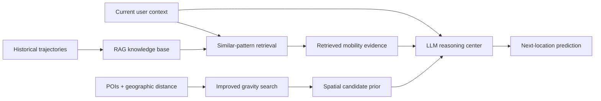

<div align="center">

# RAG²-MP
### A Mobility Prediction Method Based on Retrieval-Augmented Generation and Gravity Model

**[中文](README.md) | English**

[](https://cjc.ict.ac.cn/)
[](https://cjc.ict.ac.cn/)

**Bo Liu · Tong Li · Zhu Xiao · Zhuo Tang · Kenli Li**

*Chinese Journal of Computers, 2026 — Accepted*

</div>

---

## Overview

**RAG²-MP** is an LLM-based human mobility prediction framework that combines **Retrieval-Augmented Generation (RAG)** with an improved **Gravity Model**. The key idea is to equip an LLM with two forms of external evidence that are difficult to recover reliably from model parameters alone: empirical mobility patterns retrieved from historical trajectories and physically interpretable spatial priors derived from regional attractiveness and geographic distance.

<p align="center">
  
</p>

<p align="center"><em>RAG²-MP integrates historical mobility retrieval, gravity-based spatial priors, and LLM reasoning.</em></p>

## Abstract

Human mobility prediction plays an important role in urban traffic management, location-based recommendation, and emergency response. Existing mobility prediction approaches based on large language models exhibit strong semantic reasoning capabilities, but they largely depend on knowledge stored implicitly in static model parameters. As a result, they have difficulty explicitly exploiting statistical regularities and mobility patterns contained in historical observations. They also lack explicit spatial awareness, making it difficult to quantify geographic distance constraints and regional attractiveness, which can lead to geographically implausible predictions. To address these limitations, we propose a mobility prediction framework that integrates **Retrieval-Augmented Generation (RAG)** with an improved gravity model. First, a retrieval-augmented module constructs a historical trajectory knowledge base and dynamically retrieves similar collective mobility patterns, converting implicit mobility regularities into explicit structured knowledge that can be used during inference. Second, an improved gravity-search module explicitly models the nonlinear relationship between POI distributions and geographic distance decay, providing interpretable physical constraints and candidate-location priors. Finally, an LLM serves as the reasoning and decision center to integrate these heterogeneous information sources and generate the final semantic prediction. Extensive experiments on three large-scale real-world datasets show that RAG²-MP improves **Acc@1, Acc@5, and MRR@5 by 10.02%, 11.32%, and 8.91% on average**, respectively, compared with strong existing baselines. Further analyses demonstrate robust cross-city generalization and show that enlarging the retrieval knowledge base can further improve prediction performance.

## Motivation

RAG²-MP is built around two limitations of purely parameter-based LLM prediction:

1. **Historical mobility knowledge is implicit and static.** A model may understand generic mobility semantics, but it cannot reliably recall city-specific empirical transition patterns without explicit access to data.
2. **Spatial plausibility is weakly constrained.** Language-based reasoning alone does not naturally enforce distance decay or regional attractiveness.

RAG²-MP therefore augments the LLM with both retrieved behavioral evidence and a gravity-based physical prior.



## Method

### 1. Retrieval-Augmented Mobility Knowledge

`model/RAG.py` maintains and queries historical mobility knowledge. During inference, the module retrieves behaviorally similar trajectory patterns so that the prediction can be grounded in empirical collective behavior rather than only the LLM's internal parameters.

### 2. Improved Gravity Search

`model/Gravity.py` models regional attractiveness and nonlinear distance decay. It produces an interpretable spatial prior over candidate locations and helps filter geographically implausible predictions.

### 3. LLM-Based Semantic Decision

`model/LLM.py` and `model/Predictor.py` integrate the current context, retrieved historical evidence, and gravity-based candidate priors to produce the final next-location prediction.

## Code-to-Paper Map

| Paper component | Repository path | Role |
| --- | --- | --- |
| Historical behavior retrieval | `model/RAG.py` | Build/query the mobility knowledge base |
| Improved gravity model | `model/Gravity.py` | Spatial attractiveness and distance prior |
| LLM reasoning | `model/LLM.py` | Semantic integration of heterogeneous evidence |
| Overall predictor | `model/Predictor.py` | Coordinate modules and return predictions |
| Dataset pipeline | `dataset/dataset.py` | Construct train/test mobility samples |
| Raw mobility processing | `raw_data/mobility_process.py` | Preprocess trajectories |
| Experiment configuration | `config/config.yaml` | Data, model, RAG, and training options |
| Standard experiments | `trainer/trainer.py` | Main training/evaluation loop |
| Detailed inference analysis | `trainer/detailed_trainer.py` | Retrieval and reasoning logs / case studies |

## Datasets

The experiments use real-world mobility data from Beijing, Shenzhen, and Shanghai. Please obtain and use the data under the terms of the original providers.

| City / dataset | Data type | Source |
| --- | --- | --- |
| Beijing / CoPB | Urban mobility trajectories | https://github.com/tsinghua-fib-lab/CoPB |
| Shenzhen | Private-car GPS trajectories | https://github.com/HunanUniversityZhuXiao/PrivateCarTrajectoryData |
| Shanghai | App / mobility data | https://fi.ee.tsinghua.edu.cn/appusage/ |

## Evaluation Metrics

- **Acc@1** — whether the top-ranked prediction equals the ground-truth location.
- **Acc@5** — whether the ground truth appears among the top five candidates.
- **MRR@5** — rank-sensitive reciprocal-rank metric over the top five predictions.

The paper reports average improvements of **10.02%, 11.32%, and 8.91%** for Acc@1, Acc@5, and MRR@5, respectively, over strong baselines.

## Environment

```bash
conda env create -f environment.yml
conda activate rag2-mp
```

## Running the Project

### Step 1 — Prepare mobility data

The main raw-trajectory preprocessing logic is located in:

```text
raw_data/mobility_process.py
```

### Step 2 — Build the retrieval database and gravity prior

```bash
python util/fit_gravity_weight.py
python util/build_rag_database.py
```

### Step 3 — Train / evaluate

```bash
python trainer/trainer.py --config config/config.yaml
```

For detailed retrieval, candidate, and inference logs:

```bash
python trainer/detailed_trainer.py --config config/config.yaml
```

## Repository Structure

```text
RAG2-MP/
├── config/
│   └── config.yaml
├── dataset/
│   └── dataset.py
├── model/
│   ├── Gravity.py
│   ├── LLM.py
│   ├── Predictor.py
│   └── RAG.py
├── raw_data/
├── trainer/
│   ├── trainer.py
│   └── detailed_trainer.py
├── util/
├── sources/
│   └── framework.png
├── environment.yml
├── README.md
└── README_EN.md
```

## Paper Information

The paper **“A Mobility Prediction Method Based on Retrieval-Augmented Generation and Gravity Model”** has been accepted by the **Chinese Journal of Computers**.

- **Journal:** Chinese Journal of Computers
- **Status:** Accepted
- **Journal website:** https://cjc.ict.ac.cn/

> Volume, issue, page numbers, DOI, and the final full-text link will be updated after formal publication.

## Citation

```bibtex
@article{liu2026rag2mp,
  title   = {A Mobility Prediction Method Based on Retrieval-Augmented Generation and Gravity Model},
  author  = {Liu, Bo and Li, Tong and Xiao, Zhu and Tang, Zhuo and Li, Kenli},
  journal = {Chinese Journal of Computers},
  year    = {2026},
  note    = {Accepted}
}
```

## Author & Contact

This repository is maintained by **Bo Liu**, a Master’s student at the **College of Computer Science and Electronic Engineering, Hunan University** and the **National Supercomputing Center in Changsha**. His broader research focuses on **Agentic AI, LLMs, Spatiotemporal Intelligence, and Mobile Data Mining**.

For reproduction questions, academic discussion, or collaboration, please open an issue or contact `liubo317@hnu.edu.cn`.  
Personal homepage: https://boliupro.github.io
